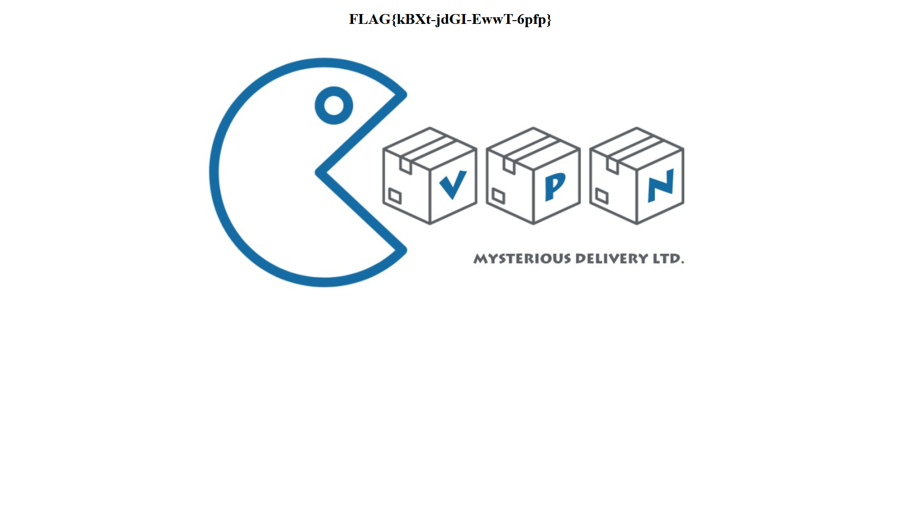

# VPN access (1)

Hi, promising candidate,

a lot of internal system is accessible only via VPN. You have to install and configure OpenVPN properly. Configuration file can be downloaded from CTFd's link [VPN](https://thecatch.cz/vpn). Activate VPN and visit testing page [http://candidate-test.mysterious-delivery.tcc](http://candidate-test.mysterious-delivery.tcc), where the control code is.

May the Packet be with you!

## Hints

- Do not run more different VPNs at once.
- [https://openvpn.net/community-resources/reference-manual-for-openvpn-2-4/](https://openvpn.net/community-resources/reference-manual-for-openvpn-2-4/)

## Solution

We simply connect to the VPN and visit [http://candidate-test.mysterious-delivery.tcc](http://candidate-test.mysterious-delivery.tcc) and see the flag.

`FLAG{kBXt-jdGI-EwwT-6pfp}`
