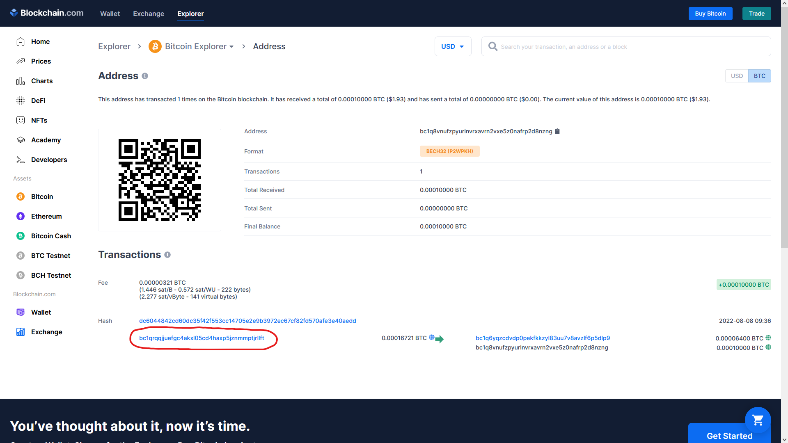
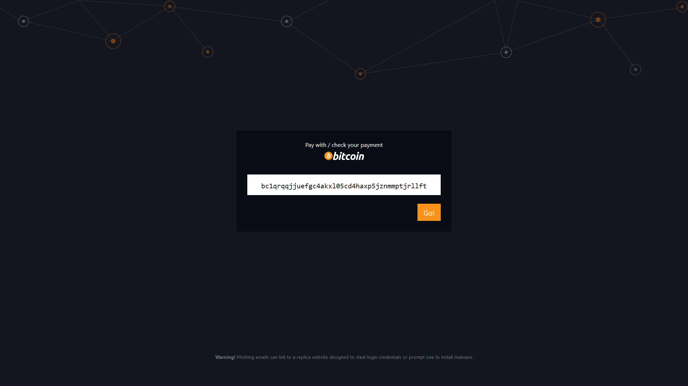
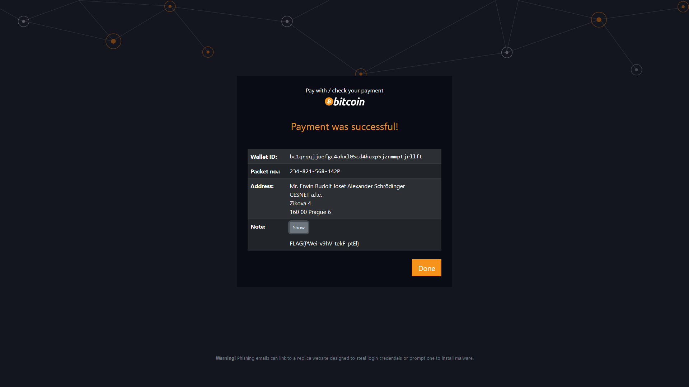

# Bitcoin wallet (1)

Hi, promising candidate,

our customers paying by bitcoin to our wallet `bc1q8vnufzpyurlnvrxavrn2vxe5z0nafrp2d8nzng` can get their package pickup code on [http://pay-check.mysterious-delivery.thecatch.cz](http://pay-check.mysterious-delivery.thecatch.cz) by entering their wallet ID.

Find out the pickup code for package that has not yet been claimed, although it was already paid for on Aug 8th 2022.

May the Packet be with you!

## Hints

- The question is: What is a blockchain?

## Solution

Definition of blockchain according to [https://bitcoin.org](https://bitcoin.org/en/vocabulary#block-chain):

> The block chain is a public record of Bitcoin transactions in chronological order. The block chain is shared between all Bitcoin users. It is used to verify the permanence of Bitcoin transactions and to prevent double spending.

For us the most important thing in this case is the first sentence, the transactions are public and are in chronological order.

We can use an online bitcoin explorer such as [https://www.blockchain.com/explorer](https://www.blockchain.com/btc/address/bc1q8vnufzpyurlnvrxavrn2vxe5z0nafrp2d8nzng) and try to find the address from which the bitcoins were sent.

`bc1qrqqjjuefgc4akxl05cd4haxp5jznmmptjrllft` this is most likely the address we're looking for, let's give it a try then.

Oh yeeah, we found the flag `FLAG{PWei-v9hV-tekF-ptEl}`
