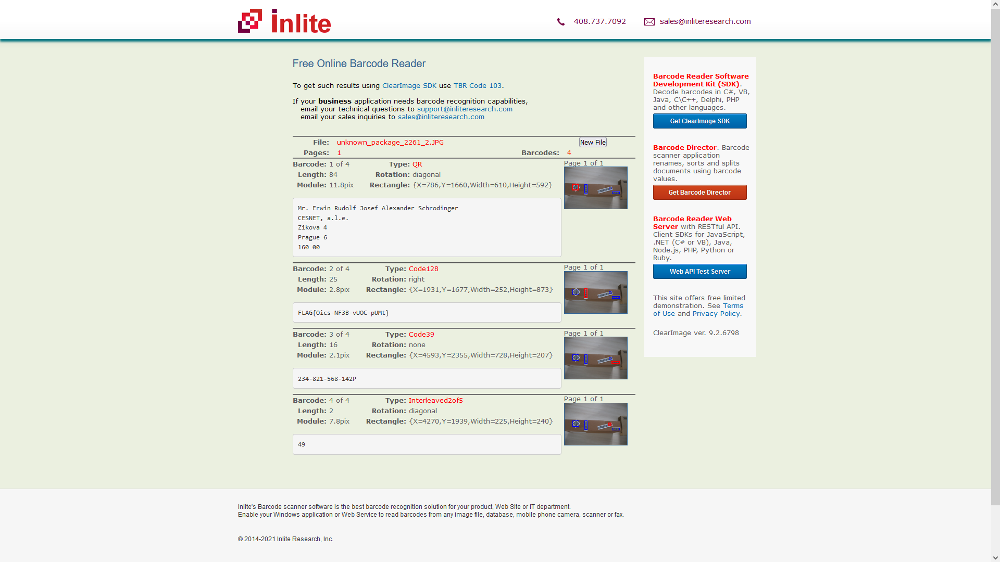

# Unknown package (1)

Hi, promising candidate,

the cleaning drones have taken pictures of some abandoned unknown package in our backup depot. The AI claims that the analysed item is in no way a package, instead it repeats "cat - animal - dangerous - avoid".

Get as much as possible information about the package.

Download [taken pictures](https://owncloud.cesnet.cz/index.php/s/YxcC6BP430nR5en) (MD5 checksum c6f700e1217c0b17b7d3a35081c9fabe).

May the Packet be with you!

## Hints

- Machines prefer some sort of codes instead of plain texts.

## Solution

From the task we have 2 pictures, on the second picture we can see QR code and bar codes.

The very first thing I tried was to decode the QR code and bar codes. By using this site [https://online-barcode-reader.inliteresearch.com](https://online-barcode-reader.inliteresearch.com), we can decode the codes.

Successfully, we found the flag `FLAG{Oics-NF3B-vUOC-pUMt}`
