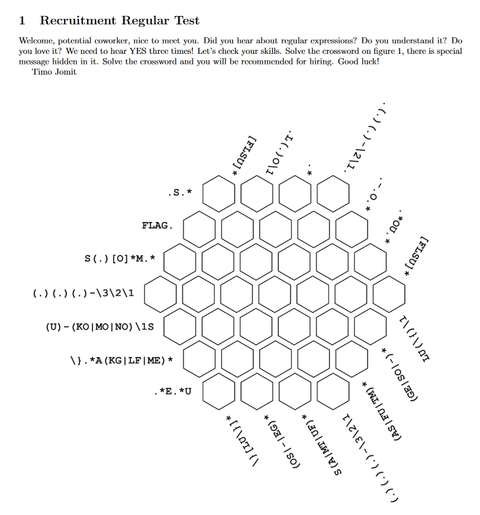
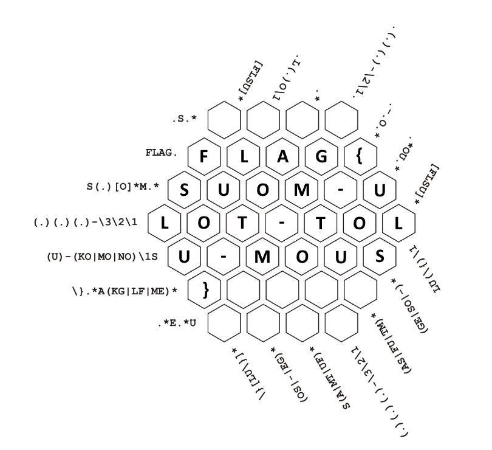

# Regex crossword (1)

Hi, promising candidate,

you have to prove the knowledge of regular expressions. Our Finnish recruiter Timo has prepared some crossword suitable for this purpose.

Download [task description](https://owncloud.cesnet.cz/index.php/s/ODNoiM6g74pK73L) (MD5 checksum 6448c1748cc6047470a5f00c3945c1c4).

May the Packet be with you!

## Hints

- https://www.rexegg.com/regex-quickstart.html

## Solution

From the task, we have one PDF that has a "hexagon" regex crossword.

The solution is simple, we need to solve the regex crossword. You just need to know regex &#8203;:)

`FLAG{SUOM-ULOT-TOLU-MOUS}`
