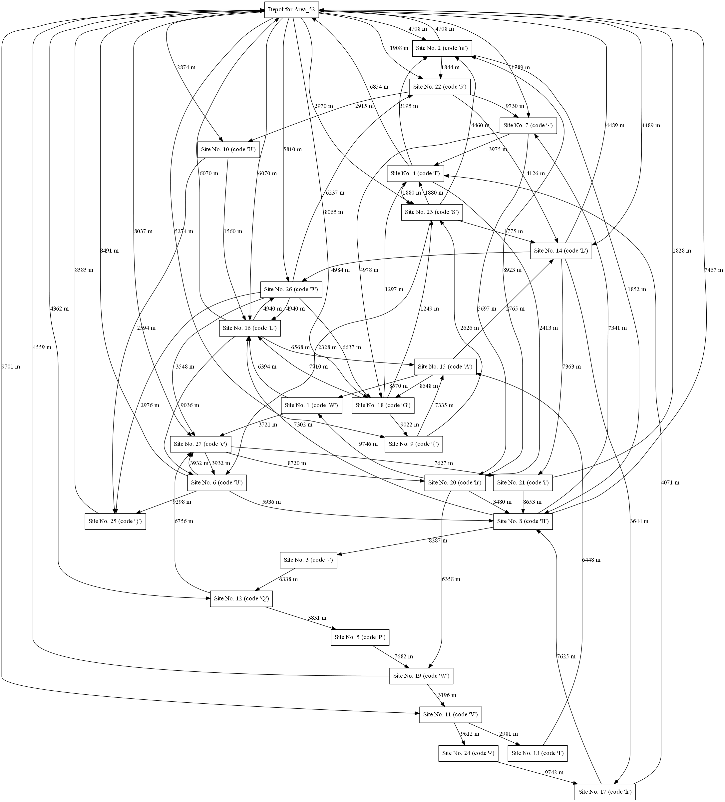

# Route tracking (2)

Hi, packet inspector,

our company uses on-board route recorders, so traffic controller can optimize movement of all vehicles and also control the schedule. Any route can be described by a text string that contains the codes of individual sites in the order in which they were visited (except depot, because each drive starts and also ends there).

Unfortunately, one of the recorders has been damaged and the particular sites were not recorded, just the total length of the route is known (exactly `163 912 meters`). In addition, the driver told us that he never visited the same place more than once (except depot, of course).

Your task is to identify the exact route of the vehicle.

Download [the map of vehicle operating area and backround info](https://owncloud.cesnet.cz/index.php/s/LKjPzl5QawyisH3) (MD5 checksum 5fd3f52bcb404eae543eba68d7f4bb0a).

May the Packet be with you!

## Hints

- The map of vehicle operating area is available as a picture and also in dot language.

## Solution

The real fun begins, from the task we get route records, in the form of an image and dot language

### Image of route



### Dot file with route records

    digraph Area_52 {
    000 [label="Depot for Area_52" shape=box]
    001 [label="Site No. 1 (code 'W')" code=W shape=box]
    002 [label="Site No. 2 (code 'm')" code=m shape=box]
    003 [label="Site No. 3 (code '-')" code="-" shape=box]
    004 [label="Site No. 4 (code 'I')" code=I shape=box]
    005 [label="Site No. 5 (code 'P')" code=P shape=box]
    006 [label="Site No. 6 (code 'U')" code=U shape=box]
    007 [label="Site No. 7 (code '-')" code="-" shape=box]
    008 [label="Site No. 8 (code 'H')" code=H shape=box]
    009 [label="Site No. 9 (code '{')" code="{" shape=box]
    010 [label="Site No. 10 (code 'U')" code=U shape=box]
    011 [label="Site No. 11 (code 'V')" code=V shape=box]
    012 [label="Site No. 12 (code 'Q')" code=Q shape=box]
    013 [label="Site No. 13 (code 'I')" code=I shape=box]
    014 [label="Site No. 14 (code 'L')" code=L shape=box]
    015 [label="Site No. 15 (code 'A')" code=A shape=box]
    016 [label="Site No. 16 (code 'L')" code=L shape=box]
    017 [label="Site No. 17 (code 'h')" code=h shape=box]
    018 [label="Site No. 18 (code 'G')" code=G shape=box]
    019 [label="Site No. 19 (code 'W')" code=W shape=box]
    020 [label="Site No. 20 (code 'h')" code=h shape=box]
    021 [label="Site No. 21 (code 'i')" code=i shape=box]
    022 [label="Site No. 22 (code '5')" code=5 shape=box]
    023 [label="Site No. 23 (code 'S')" code=S shape=box]
    024 [label="Site No. 24 (code '-')" code="-" shape=box]
    025 [label="Site No. 25 (code '}')" code="}" shape=box]
    026 [label="Site No. 26 (code 'F')" code=F shape=box]
    027 [label="Site No. 27 (code 'c')" code=c shape=box]
    000 -> 002 [label="4708 m" dist=4708]
    000 -> 007 [label="1789 m" dist=1789]
    000 -> 009 [label="5274 m" dist=5274]
    000 -> 010 [label="2874 m" dist=2874]
    000 -> 011 [label="9701 m" dist=9701]
    000 -> 012 [label="4362 m" dist=4362]
    000 -> 014 [label="4489 m" dist=4489]
    000 -> 016 [label="6070 m" dist=6070]
    ...

[The whole file here Area_52.dot](Area_52.dot)

Let's summarize what we know:

- Driver never visited the same place twice except depot (000).
- Total length of the route is 163 912 metres.
- The flag format is FLAG{xxxx-xxxx-xxxx-xxxx} _(very useful for our script below)_

The best thing I could think of was to recursively find the right path.

**[script.js](script.js)**

```js
const PATHS = [
  ["000", "002", 4708],
  ["000", "007", 1789],
  ["000", "009", 5274],
  ["000", "010", 2874],
  ["000", "011", 9701],
  ["000", "012", 4362],
  ["000", "014", 4489],
  ["000", "016", 6070],
  ["000", "018", 8065],
  ["000", "022", 1908],
  ["000", "023", 2970],
  ["000", "026", 5810],
  ["000", "027", 8037],
  ["001", "016", 6394],
  ["001", "027", 3721],
  ["002", "000", 4708],
  ["002", "008", 1852],
  ...
];

codes = {
  "000": "",
  "001": "W",
  "002": "m",
  "003": "-",
  "004": "I",
  "005": "P",
  "006": "U",
  "007": "-",
  "008": "H",
  "009": "{",
  "010": "U",
  "011": "V",
  "012": "Q",
  "013": "I",
  "014": "L",
  "015": "A",
  "016": "L",
  "017": "h",
  "018": "G",
  "019": "W",
  "020": "h",
  "021": "i",
  "022": "5",
  "023": "S",
  "024": "-",
  "025": "}",
  "026": "F",
  "027": "c",
};

const TOTAL_DISTANCE = 163912;

flag = "";

function searchRecursive(paths, alreadyUsed, distance, flag) {
  // Check if we crossed the total distance
  if (distance > TOTAL_DISTANCE) {
    return;
  }

  // Check if we found the flag
  if (distance === TOTAL_DISTANCE) {
    console.log(flag);
    return;
  }

  paths.forEach((path) => {
    let available = availableRoutes(path[1], alreadyUsed);

    if (flag.length === 0 && codes[path[1]] !== "F") return; // First index must be F

    if (flag.length === 1 && codes[path[1]] !== "L") return; // Second index must be L

    if (flag.length === 2 && codes[path[1]] !== "A") return; // Second index must be A

    if (flag.length === 3 && codes[path[1]] !== "G") return; // Third index must be G

    if (flag.length === 4 && codes[path[1]] !== "{") return; // Fourth index must be {

    if (flag.length >= 5 && flag.length <= 8 && codes[path[1]] === "-") return; // Fifth to eighth index must not be -

    if (flag.length === 9 && codes[path[1]] !== "-") return; // Ninth index must be -

    if (flag.length >= 10 && flag.length <= 13 && codes[path[1]] === "-")
      return; // Tenth to thirteenth index must not be -

    if (flag.length === 14 && codes[path[1]] !== "-") return; // Fourteenth index must be -

    if (flag.length >= 15 && flag.length <= 18 && codes[path[1]] === "-")
      return; // Fifteenth to eightteenth index must not be -

    if (flag.length === 19 && codes[path[1]] !== "-") return; // Nineteenth index must be -

    // Search again recursively
    searchRecursive(
      available,
      alreadyUsed.concat(path[0] === "000" ? [] : path[0]),
      distance + path[2],
      flag + codes[path[1]]
    );
  });
}

// Get all available routes from a given start point
function availableRoutes(from, alreadyUsed) {
  let found = PATHS.filter((path) => path[0] === from);

  return found.filter((path) => !alreadyUsed.includes(path[1]));
}

// Start the search
searchRecursive(availableRoutes("000", []), [], 0, "");
```

We run the script and immediately get `FLAG{SLiH-QPWV-hIm5-hWcU}`
