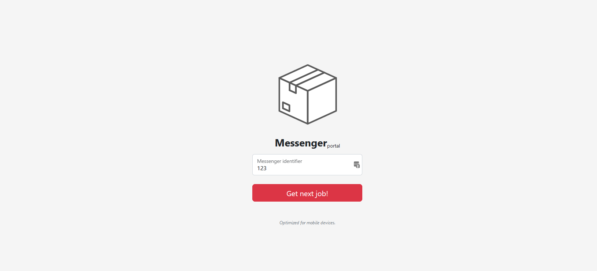
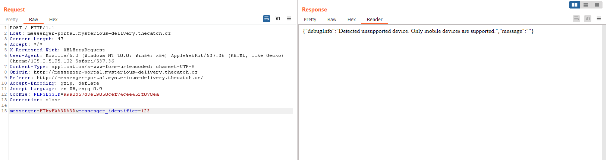
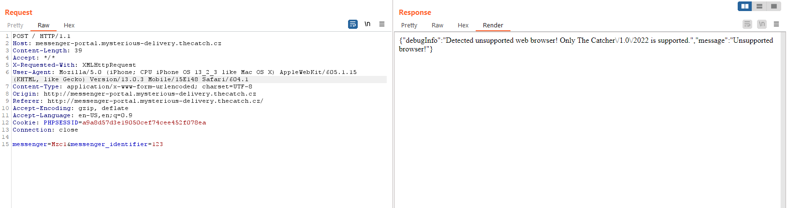
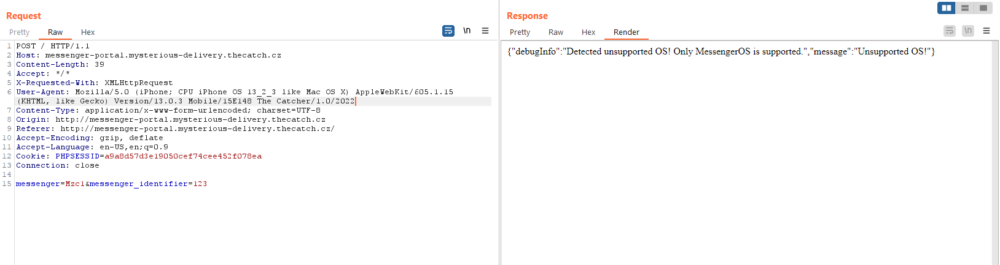
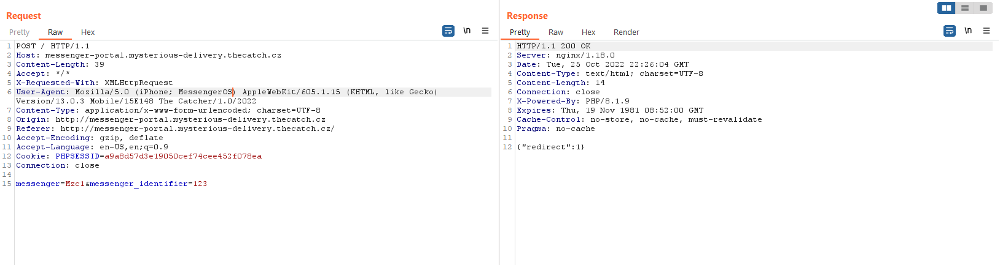
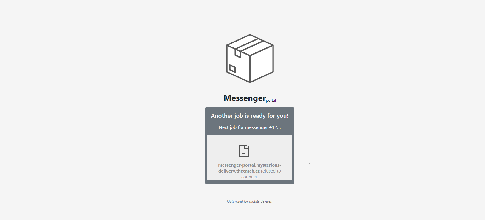
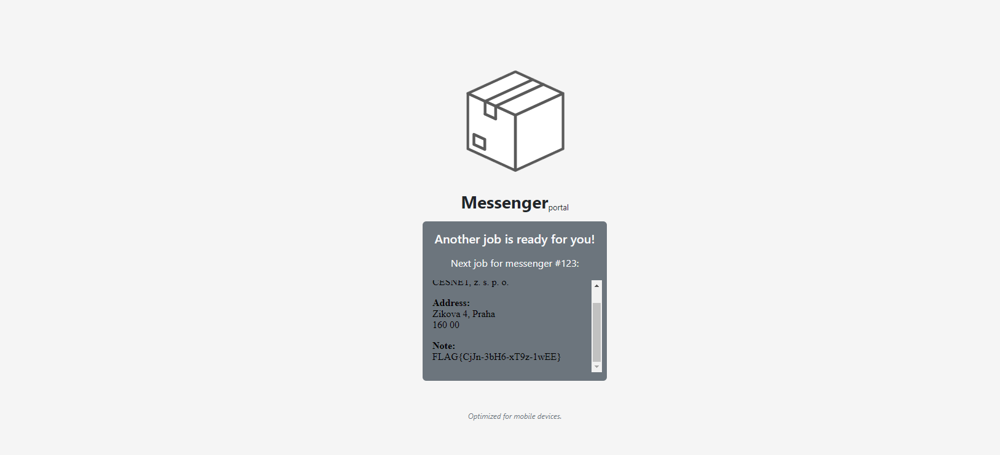

# Messenger portal (3)

Hi, packet inspector,

our messengers are dependent on aplication called Messenger portal when they are in the field. It allows to display various information they need to do their jobs on their special mobile devices.

Currently, the AI has installed new modern and fully responsive version of the Messenger portal – even the validation of messenger numeric ID is not implemented yet and the messengers report problem with displaying details of they deliveries.

You have to analyze the [Messenger portal](http://messenger-portal.mysterious-delivery.thecatch.cz/) and find some way to get detail information about deliveries. Hurry, please, the packages are pilling up!

May the Packet be with you!

## Hints

- Messengers use special mobile devices.

## Solution

After quick input testing, we can see that the input accepts any number, nothing special.

The interesting part comes with the server response, _only mobile devices are supported_. Let's rewrite the User-Agent header so the server thinks we're on mobile

It works, now the problem is web browser.

And now the operating system.

Finally, User-Agent is no longer a problem.

We are redirected to [http://messenger-portal.mysterious-delivery.thecatch.cz/?messenger=123](http://messenger-portal.mysterious-delivery.thecatch.cz/?messenger=123). We can see an iframe with source http://messenger-portal.mysterious-delivery.thecatch.cz/?messenger-jobs, but it does not render.

It doesn't render because of the [X-Frame-Options response header](https://developer.mozilla.org/en-US/docs/Web/HTTP/Headers/X-Frame-Options), which is set to DENY.

The fastest solution is to simply use the [Ignore X-Frame headers](https://chrome.google.com/webstore/detail/ignore-x-frame-headers/gleekbfjekiniecknbkamfmkohkpodhe) browser extension.

`FLAG{CjJn-3bH6-xT9z-1wEE}`
