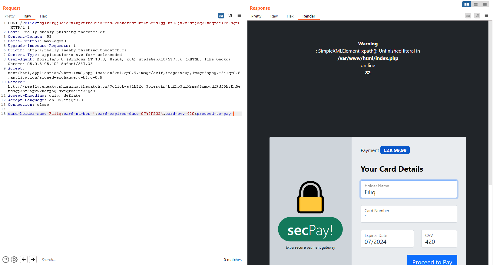
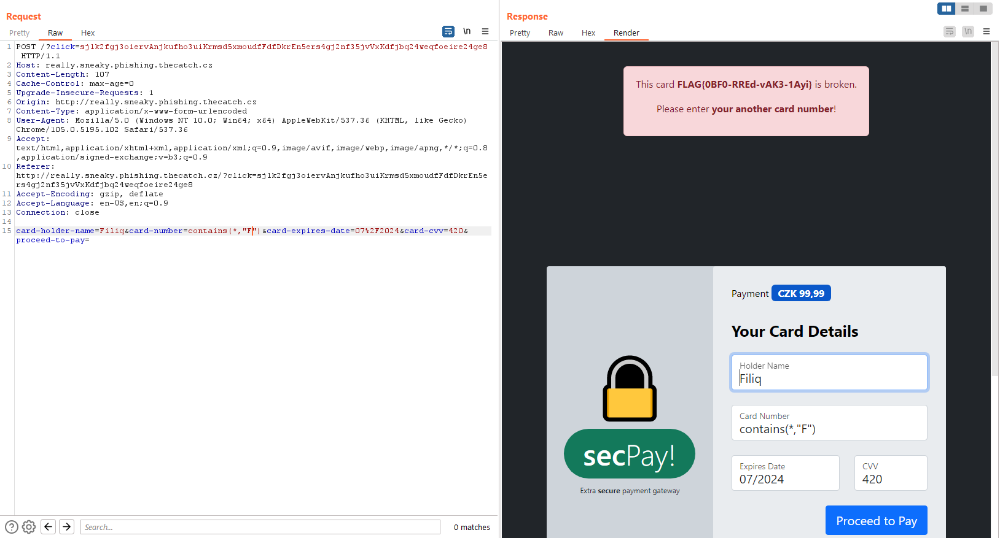

# Fraudulent e-mail (3)

Hi, packet inspector,

we have a apparently problem with some fraudulent payment gateway (see forwarded e-mail). We suspect that many of our customers have come across this scam.

Identify all card numbers entered into the fraudulent webpage (we have to report incident and its details to CSIRT-TCC).

Download [fraudulent e-mail](https://owncloud.cesnet.cz/index.php/s/sP8kJqndbmYzQoj) (MD5 checksum 94c7696bed436cd63a490de4008d2022).

May the Packet be with you!

## Hints

- Fraudsters never have time for anything, they usually slack off even validating inputs.

## Solution

We got an .eml file from the task where we can find the malicious link.

```html
Please use the link
<a
  href="http://really.sneaky.phishing.thecatch.cz/?click=sjlk2fgj3oiervAnjkufho3uiKrmsd5xmoudfFdfDkrEn5ers4gj2nf35jvVxKdfjbq24weqfoeire24ge8"
  >http://messenger-portal.mysterious-delivery.thecatch.cz
</a>
to complete payment.
```

Let's visit the _[really sneaky phishing site](http://really.sneaky.phishing.thecatch.cz/?click=sjlk2fgj3oiervAnjkufho3uiKrmsd5xmoudfFdfDkrEn5ers4gj2nf35jvVxKdfjbq24weqfoeire24ge8)_.


I seriously filled out the form to see the response. It response with card number I filled out. The format of the card also reminds me the flag format, but that could just be a coincidence.


What happens if we send something else to the server instead of a 16 digit number, such as a single quote `'`?

We got an XPath error, time for XPath injection.



This site [https://book.hacktricks.xyz/pentesting-web/xpath-injection](https://book.hacktricks.xyz/pentesting-web/xpath-injection) helped me a lot to understand XPath.

Instead of a 16 digit number I send `contains(*, "F")`.

- `contains(string, string)` determines whether the first argument string contains the second argument string
- `*` matches any element node
- `F` first letter of FLAG{xxxx-xxxx-xxxx-xxxx}



`FLAG{0BF0-RREd-vAK3-1Ayi}`
