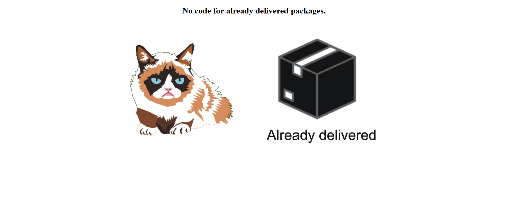
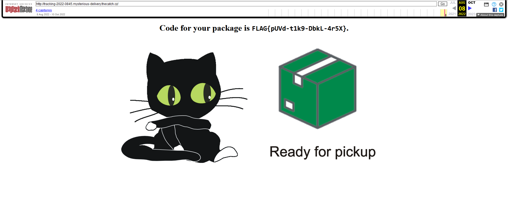

# Old webpages (1)

Hi, packet inspector, the AI has apparently some problems to transfer data from previous information system to new one. All packages in state "waiting for pickup" were erroneously moved to state "delivered". Now, we have an angry customer in our depot and she want her package with shipment ID 2022-0845.

In the previous IS, each package had his own domain name (for example, ID 2022-0845 can be tracked on [http://tracking-2022-0845.mysterious-delivery.thecatch.cz](http://tracking-2022-0845.mysterious-delivery.thecatch.cz)).

Find the pickup code for package `2022-0845` as soon as possible, so we can give it to depot drone.

May the Packet be with you!

## Hints

- The previous system was really old, one can say even ancient or archive.

## Solution

Looking at the website, there is literally nothing interesting.



Source code

```html
<!DOCTYPE html>
<html lang="en">
  <meta charset="UTF-8" />
  <title>The Catch 2022</title>
  <meta name="viewport" content="width=device-width,initial-scale=1" />
  <link rel="stylesheet" href="" />
  <style></style>
  <body>
    <center>
      <div class="">
        <h1>No code for already delivered packages.</h1>
      </div>

      
    </center>
  </body>
</html>
```

Even though this challenge is only worth 1 point, it took me quite a long time to find a solution. Reading the hint about 1000 times and wondering where the problem was, I tried to check the [web.archive.org](https://web.archive.org/web/20220000000000*/http://tracking-2022-0845.mysterious-delivery.thecatch.cz/).



It was that easy... `FLAG{pUVd-t1k9-DbkL-4r5X}`
