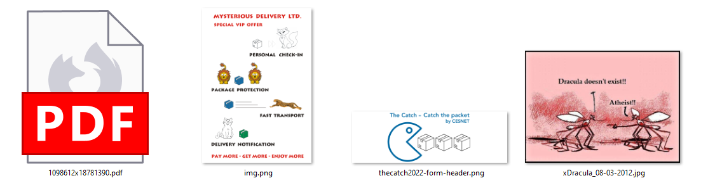
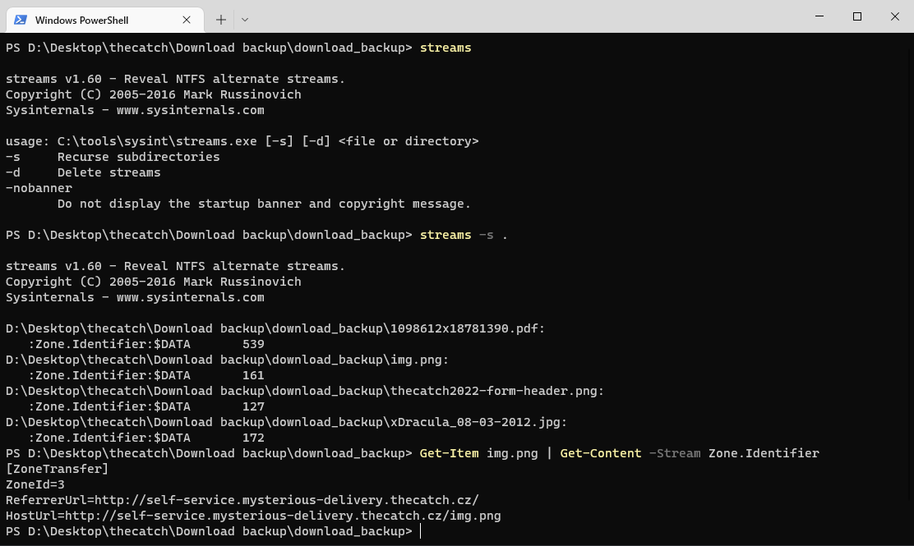

# Download backup (2)

Hi, packet inspector,

our former employee Brenda (head of PR department) was working on new webpage with superdiscount code for VIP customers, but she get fired by AI because of "disturbing lack of machine precision".

Your task is to find the code as soon as possible. The only hope is an automated backup of Brenda's `Download` directory (there is a high probability that she had downloaded the discount page or part of it).

Download [the backup file](https://owncloud.cesnet.cz/index.php/s/ZgIMem5NDbS5SYZ) (MD5 checksum 2fd749e99a0237f506a0eb3e81633ad7).

May the Packet be with you!

## Hints

- Brenda's favorite browser was `MS Edge`, i.e. she used `MS Windows` (running the filesystem `NTFS`).

## Solution

The backup contains 1 [PDF](https://www.researchgate.net/publication/326313071_Shelter_housing_for_cats_Practical_aspects_of_design_and_construction_and_adaptation_of_existing_accommodation) and 3 images.

The hint says that Brenda uses NTFS file system, that's a big hint for us. NTFS has one interesting feature for us - [alternate data streams](https://learn.microsoft.com/en-us/openspecs/windows_protocols/ms-fscc/c54dec26-1551-4d3a-a0ea-4fa40f848eb3).

In the picture above we can see `ReferrerUrl=http://self-service.mysterious-delivery.thecatch.cz/` so let's simply visit the website.

`FLAG{16bd-0c4x-ZRJe-8HC3}`
