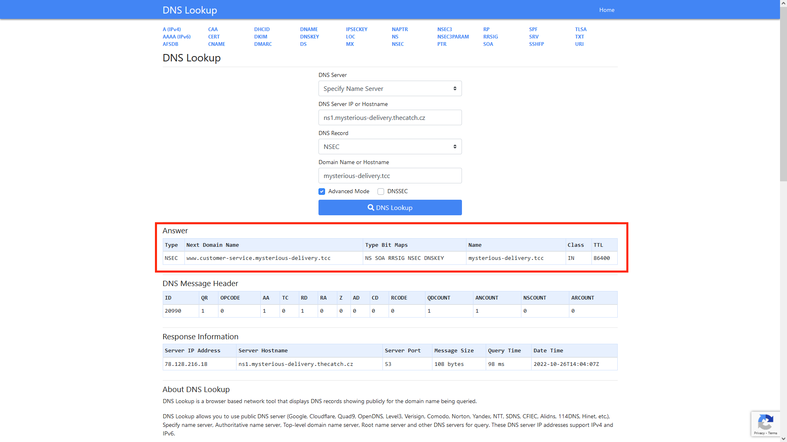

# DNS storage (3)

Hi, packet inspector,

biggest surprise of the day is that the AI has started to use DNS as a storage for its own information. The data are stored in TXT resource records in the zone `mysterious-delivery.tcc`. The zone is deployed on DNS servers `ns1.mysterious-delivery.thecatch.cz` and `ns2.mysterious-delivery.thecatch.cz`.

Analyze content of zone and focus on any codes for our depot steel safes (AI has changed the access code and we hope it is stored right in the DNS zone).

May the Packet be with you!

## Hints

- The zone is secured by DNSSEC.

## Solution

Here's a nice page [dnslookup.online](https://dnslookup.online/) that may help you better understand the script below.



We are interested in 2 values - Next Domain Name and Type Bit Maps.

- **Next domain name** - tell us next domain name _(how unexpected)_
- **Type Bit Maps** - tell us all available DNS records for next domain name (we are only interested in TXT).

**[script.py](script.py)**

```py
import dns.resolver

my_resolver = dns.resolver.Resolver()

my_resolver.nameservers = ["78.128.216.18", "78.128.246.141"] # ns1.mysterious-delivery.thecatch.cz and ns2.mysterious-delivery.thecatch.cz.

domain_name = "mysterious-delivery.tcc"

while(True):
    answer = my_resolver.resolve(domain_name, rdtype='NSEC')
    answer = answer.rrset.to_text().split(" ")

    domain_name = answer[4] # Next Domain Name
    available_types = answer[5:] # Type Bit Maps

    if("TXT" in available_types):
        try:
            txt = my_resolver.resolve(domain_name, rdtype="TXT")

            # Check if TXT contains "flag"
            if(txt.rrset.to_text().lower().find("flag") != -1):
                print(txt.rrset.to_text())
        except:
            continue
```

Output:

```
depot-brno.mysterious-delivery.tcc. 86400 IN TXT "sorry, no flags in brno"
depot-secret-upon-flag.mysterious-delivery.tcc. 86400 IN TXT "secret code for steel safe is: RkxBR3tZcjMxLVhvWEUtNEZxOC02UElzfQ=="
```

After decoding `RkxBR3tZcjMxLVhvWEUtNEZxOC02UElzfQ==` from base64 we get `FLAG{Yr31-XoXE-4Fq8-6PIs}`
