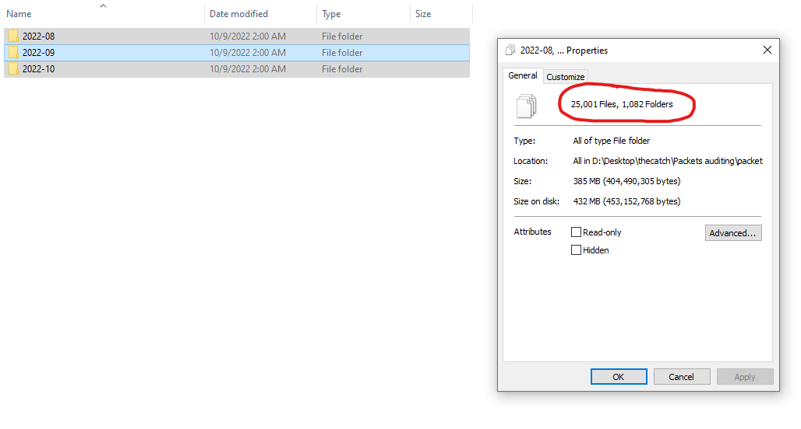
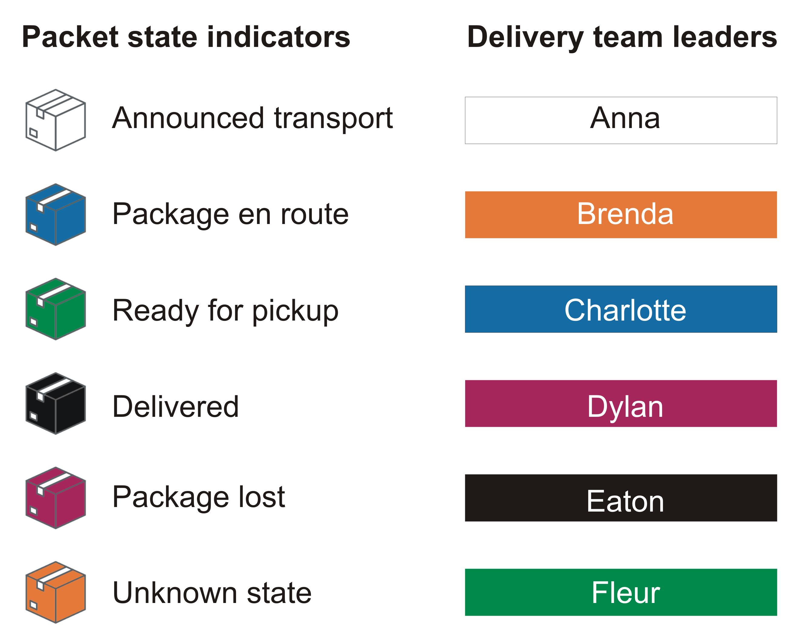
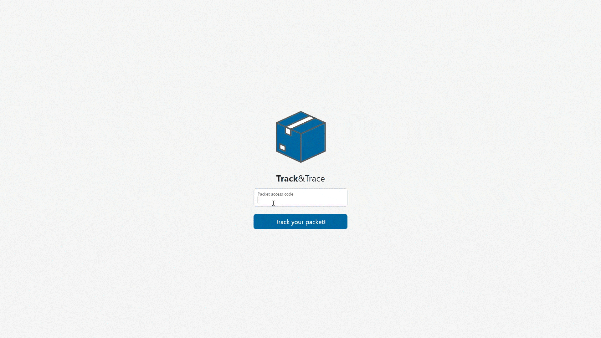

# Packets auditing (3)

Hi, packet inspector,

the AI has "upgraded" our packet auditing system – time to time, it generates archive of pictures, where the state of packet and the appropriate delivery team is indicated by different colours for each packet transport number.

We have a plea from Brenda's delivery team to find their missing packet in state ready for pickup (the other teams have already delivered all their packages mentioned in last given audit archive).

Download [audit archive](https://owncloud.cesnet.cz/index.php/s/BGSbaBDCsuWdAYO) (MD5 checksum 08ee155d2c9aee13ea5cab0a11196129), find the desired pickup code and enter it on webpage [http://pickup.mysterious-delivery.thecatch.cz](http://pickup.mysterious-delivery.thecatch.cz) to collect pickup code.

May the Packet be with you!

## Hints

- Too many images for manual processing, right?

## Solution

After downloading the audit archive, which is 371 MB large, we can understand the hint _"Too many images for manual processing, right?"_

_[audit archive reduced example here](packets/)_



We also got a description file from which we can figure out what the image of Brenda's delivery team missing packet will look like. It will be green package with orange background.



**[script.py](script.py)**

```py
from PIL import Image
import os

def analayseImage(path):
    im = Image.open(path)
    pix = im.load()

    package_pixel_color = pix[50,50]
    background_pixel_color = pix[3, 3]

    def isPackageReadyForPickup(pixel):
        if pixel == (0, 133, 71):
            return True
        return False


    def isDeliveryTeamBrenda(pixel):
        if pixel == (242, 121, 48):
            return True
        return False

    return isDeliveryTeamBrenda(background_pixel_color) and isPackageReadyForPickup(package_pixel_color)

def searchPackage(top_dir):
    for directory in os.listdir(top_dir):
        for subdirectory in os.listdir(os.path.join(top_dir, directory)):
            for subsubdirectory in os.listdir(os.path.join(top_dir, directory, subdirectory)):
                for file in os.listdir(os.path.join(top_dir, directory, subdirectory, subsubdirectory)):
                        if(analayseImage(os.path.join(top_dir, directory, subdirectory, subsubdirectory, file))):
                            return os.path.join(top_dir, directory, subdirectory, subsubdirectory, file)

print(searchPackage("packets"))
```

`Output: packets\2022-08\30\19\000000.png`


Great, let's use the code on [http://pickup.mysterious-delivery.thecatch.cz](http://pickup.mysterious-delivery.thecatch.cz).



`FLAG{rNM8-Aa5G-dF5y-6LqY}`
